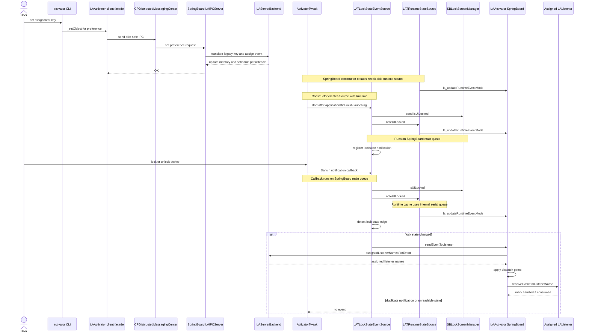

# 低风险事件源端到端流程

本文记录以 `device locked / unlocked` 为例的端到端流程。图中 participant 只表示真实角色或组件；队列和线程只作为关键动作的执行上下文说明，不作为 participant。

关键约定：event source 可以在来源队列接收系统信号，但读取 SpringBoard/UI 状态和调用 `sendEventToListener:` 的路径应回到 SpringBoard main queue；如果某个 adapter 本身读取 SpringBoard/UI/SPI 状态，它应像 `LATLockStateEventSource` 一样声明为 main-queue confined。
